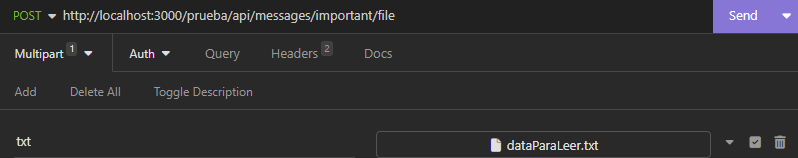

# Inicializar el proyecto y dependencias

```sh
npm install
```

Para correr el servidor

```sh
node app.js
```

# Documentacion API

## GET Folders

Devuelve un JSON con los folders e informacion

**Endpoint:**

```http
http://localhost:3000/:usuario/api/folders
```

**Params:**
`usuario`: Usuario que va a realizar la peticion

**Resultado**

```json
[
  {
    "id": 1,
    "name": "inbox",
    "title": "Inbox",
    "icon": "move_to_inbox"
  },
  {
    "id": 2,
    "name": "sent",
    "title": "Sent",
    "icon": "send"
  },
  {
    "id": 3,
    "name": "drafts",
    "title": "Drafts",
    "icon": "drafts"
  }
]
```

## GET Messages List

Devuelve un JSON con los message que coinciden con los parámetros especificados.

**Endpoint:**

```http
http://localhost:3000/:usuario/api/messages/important?from=:from&to=:to&subject=:subject

```

Ejemplo

```http
http://localhost:3000/ramiUser/api/messages/important?from=Alice&to=me&subject=Commits
```

**Params:**
`usuario`: Usuario que va a realizar la peticion
`from (opcional)`: Remitente del mensaje
`to (opcional)` : Destino del mensaje
`subject (opcional)`: Titulo del mensaje

**Resultado**

```json
[
  {
    "id": "15459251a6d6b397565",
    "from": {
      "name": "Alice Freeman",
      "avatar": "assets/images/avatars/alice.jpg",
      "email": "alicefreeman@creapond.com"
    },
    "to": [
      {
        "name": "me",
        "email": "johndoe@creapond.com"
      }
    ],
    "subject": "Commits that need to be pushed lorem ipsum dolor sit amet, consectetur adipiscing elit.",
    "message": "<p>Lorem ipsum dolor sit amet, consectetur adipiscing elit. Fusce lorem diam, pulvinar id nisl non, ultrices maximus nibh. Suspendisse ut justo velit. Nullam ac ultrices risus, quis auctor orci. Vestibulum volutpat nisi et neque porta ullamcorper. Maecenas porttitor porta erat ac suscipit. Sed cursus leo ut elementum fringilla. Maecenas semper viverra erat, vel ullamcorper dui efficitur in. Vestibulum placerat imperdiet tellus, et tincidunt eros posuere eget. Proin sit amet facilisis libero. Nulla eget est ut erat aliquet rhoncus. Quisque ac urna vitae dui hendrerit sollicitudin vel id sem. </p><p> In eget ante sapien. Quisque consequat velit non ante finibus, vel placerat erat ultricies. Aliquam bibendum justo erat, ultrices vehicula dolor elementum a. Mauris eu nisl feugiat ligula molestie eleifend. Aliquam efficitur venenatis velit ac porta. Vivamus vitae pulvinar tellus. Donec odio enim, auctor eget nibh mattis, ultricies dignissim lacus. Phasellus non tincidunt dui. Nulla eu arcu lorem. </p><p> Donec non hendrerit augue, lobortis sollicitudin odio. Class aptent taciti sociosqu ad litora torquent per conubia nostra, per inceptos himenaeos. Duis sit amet euismod enim, eget vestibulum justo. Fusce a placerat lectus, eget feugiat purus. Cras risus ante, faucibus eget justo commodo, volutpat tempor ante. Donec sit amet leo venenatis, gravida quam sit amet, blandit dui. In quam ante, elementum ut faucibus nec, tristique vitae dui. Praesent vel erat at enim placerat luctus vel ut ipsum. In congue tempor mi, non ornare lectus condimentum at. Aenean libero diam, finibus eget sapien et, tristique fermentum lorem. </p>",
    "time": "28 Jun",
    "read": false,
    "starred": false,
    "important": true,
    "hasAttachments": true,
    "attachments": [
      {
        "type": "image",
        "fileName": "flowers",
        "preview": "assets/images/etc/flowers-thumb.jpg",
        "url": "",
        "size": "1.1Mb"
      },
      {
        "type": "image",
        "fileName": "snow",
        "preview": "assets/images/etc/snow-thumb.jpg",
        "url": "",
        "size": "380kb"
      },
      {
        "type": "image",
        "fileName": "sunrise",
        "preview": "assets/images/etc/sunrise-thumb.jpg",
        "url": "assets/images/etc/early-sunrise.jpg",
        "size": "17Mb"
      }
    ],
    "labels": [1]
  }
]
```

## POST Message Create

```http
http://localhost:3000/:usuario/api/messages/important
```

**Params :**
`usuario`: Usuario que va a realizar la peticion

**Cuerpo de la Solicitud (JSON):**

```Json
{
        "from": {
            "name": "Facundo Almon",
            "avatar": "assets/images/avatars/vincent.jpg",
            "email": "lawrencecollins@creapond.com"
        },
        "to": [
            {
                "name": "me",
                "email": "johndoe@creapond.com"
            }
        ],
        "subject": "Commits that need to be pushed lorem ipsum dolor sit amet, consectetur adipiscing elit.",
        "message": "<p>Lorem ipsum dolor sit amet, consectetur adipiscing elit. Fusce lorem diam, pulvinar id nisl non, ultrices maximus nibh. Suspendisse ut justo velit. Nullam ac ultrices risus, quis auctor orci. Vestibulum volutpat nisi et neque porta ullamcorper. Maecenas porttitor porta erat ac suscipit. Sed cursus leo ut elementum fringilla. Maecenas semper viverra erat, vel ullamcorper dui efficitur in. Vestibulum placerat imperdiet tellus, et tincidunt eros posuere eget. Proin sit amet facilisis libero. Nulla eget est ut erat aliquet rhoncus. Quisque ac urna vitae dui hendrerit sollicitudin vel id sem. </p><p> In eget ante sapien. Quisque consequat velit non ante finibus, vel placerat erat ultricies. Aliquam bibendum justo erat, ultrices vehicula dolor elementum a. Mauris eu nisl feugiat ligula molestie eleifend. Aliquam efficitur venenatis velit ac porta. Vivamus vitae pulvinar tellus. Donec odio enim, auctor eget nibh mattis, ultricies dignissim lacus. Phasellus non tincidunt dui. Nulla eu arcu lorem. </p><p> Donec non hendrerit augue, lobortis sollicitudin odio. Class aptent taciti sociosqu ad litora torquent per conubia nostra, per inceptos himenaeos. Duis sit amet euismod enim, eget vestibulum justo. Fusce a placerat lectus, eget feugiat purus. Cras risus ante, faucibus eget justo commodo, volutpat tempor ante. Donec sit amet leo venenatis, gravida quam sit amet, blandit dui. In quam ante, elementum ut faucibus nec, tristique vitae dui. Praesent vel erat at enim placerat luctus vel ut ipsum. In congue tempor mi, non ornare lectus condimentum at. Aenean libero diam, finibus eget sapien et, tristique fermentum lorem. </p>",
        "time": "28 Jun",
        "read": true,
        "starred": false,
        "important": true,
        "hasAttachments": false,
        "labels": []
    }

```

**Resultado**

```Json
{
    "from": {
        "name": "Facundo Almon",
        "avatar": "assets/images/avatars/vincent.jpg",
        "email": "lawrencecollins@creapond.com"
    },
    "to": [
        {
            "name": "me",
            "email": "johndoe@creapond.com"
        }
    ],
    "subject": "Commits that need to be pushed lorem ipsum dolor sit amet, consectetur adipiscing elit.",
    "message": "<p>Lorem ipsum dolor sit amet, consectetur adipiscing elit. Fusce lorem diam, pulvinar id nisl non, ultrices maximus nibh. Suspendisse ut justo velit. Nullam ac ultrices risus, quis auctor orci. Vestibulum volutpat nisi et neque porta ullamcorper. Maecenas porttitor porta erat ac suscipit. Sed cursus leo ut elementum fringilla. Maecenas semper viverra erat, vel ullamcorper dui efficitur in. Vestibulum placerat imperdiet tellus, et tincidunt eros posuere eget. Proin sit amet facilisis libero. Nulla eget est ut erat aliquet rhoncus. Quisque ac urna vitae dui hendrerit sollicitudin vel id sem. </p><p> In eget ante sapien. Quisque consequat velit non ante finibus, vel placerat erat ultricies. Aliquam bibendum justo erat, ultrices vehicula dolor elementum a. Mauris eu nisl feugiat ligula molestie eleifend. Aliquam efficitur venenatis velit ac porta. Vivamus vitae pulvinar tellus. Donec odio enim, auctor eget nibh mattis, ultricies dignissim lacus. Phasellus non tincidunt dui. Nulla eu arcu lorem. </p><p> Donec non hendrerit augue, lobortis sollicitudin odio. Class aptent taciti sociosqu ad litora torquent per conubia nostra, per inceptos himenaeos. Duis sit amet euismod enim, eget vestibulum justo. Fusce a placerat lectus, eget feugiat purus. Cras risus ante, faucibus eget justo commodo, volutpat tempor ante. Donec sit amet leo venenatis, gravida quam sit amet, blandit dui. In quam ante, elementum ut faucibus nec, tristique vitae dui. Praesent vel erat at enim placerat luctus vel ut ipsum. In congue tempor mi, non ornare lectus condimentum at. Aenean libero diam, finibus eget sapien et, tristique fermentum lorem. </p>",
    "time": "2024-01-23T15:55:05.093Z",
    "read": true,
    "starred": false,
    "important": true,
    "hasAttachments": false,
    "labels": [],
    "id": "5b506554-1820-469d-bb9f-906b039fff0c"
}
```

## DELETE Messages

Dado un idMensaje, elimina el mensaje correspondiente

**Endpoint:**

```http
http://localhost:3000/:usuario/api/messages/important/:idMensaje
```

**Ejemplo**

```http
http://localhost:3000/:usuario/api/messages/important/15459251a6d6b397565
```

**Params:**
`usuario`: Usuario que va a realizar la peticion
`idMensaje`: Identificacion del mensaje que se desea borrar

**Resultado**

```JSON
OK
```

## POST Message File

**Endpoint:**

```http
http://localhost:3000/:usuario/api/messages/important/file
```

**Params:**
`usuario`: Usuario que va a realizar la peticion

**Cuerpo de la Solicitud:**
Adjuntar archivo con nombre de variable "txt"

Seleccionar "Structured" : Multipart form , agregar archivo con nombre "txt".

Ejemplo:


**Resultado**

```Json
{
	"message": "Recibido correctamente",
	"data": "Estoy leyendo el archivo 'dataParaLeer'"
}
```
